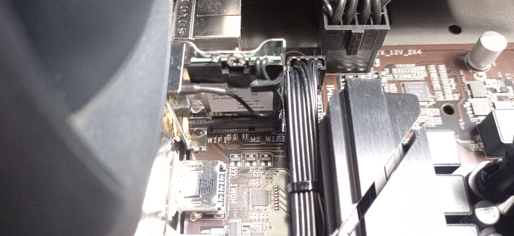

# Workstation-Hackintosh
My attempt at transforming my current PC build into a hackintosh.

## Install specifications

| Item     | Version       |
|----------|---------------|
| MacOS    | Ventura 13.4  |
| OpenCore | 0.9.3-RELEASE |
| BIOS     | F21           |

### Sonoma Upgrade

> ⚠️ Wi-Fi cards are not supported in MacOS as of writing this. Bluetooth will still work on the same cards though.

You can upgrade to sonoma using this setup. However at the time of creating this it is still in beta, so do it at your own risk. You can download the Install Assistant from [this link](https://swcdn.apple.com/content/downloads/23/44/032-94352-A_DB05J15QWT/4x91v0yzolyiat5cat76ieu0h78aeu3d03/InstallAssistant.pkg) which will help you upgrade.

## PC Specifications

| Component Type | Component                                |
|----------------|------------------------------------------|
| CPU            | Intel Core I3-13100                      |
| GPU            | Radeon RX 6650 XT                        |
| Motherboard    | Gigabyte B660 DS3H AX DDR4               |
| RAM            | Corsair Vengance LPX 2 x 8GB 3200Mhz Kit |
| Storge         | Crucial P3 Plus 1TB                      |
|                | Crucial P3 Plus 1TB                      |

## Component Support

| Component               | Support                   | Description                                                                                          |
|-------------------------|---------------------------|------------------------------------------------------------------------------------------------------|
| CPU                     | Full support              | Spoofed to an i5 10th gen. Power manegement has been patched using CPUFriend.                        |
| GPU                     | Full support              | Supported using AMDRadeonNavi2xExt kext.                                                             |
| RAM                     | Full support              | Any RAM should work with this configuration.                                                         |
| Storage                 | Full support              | Any SSD/HDD should work, though having an SSD is highly recommended.                                 |
| Audio (IN/OUT/Internal) | Full support              | Supported using AppleALC kext.                                                                       |
| USB A/C 2.0/3.0 Ports   | Full support              | Fully supported using custom SSDT and kext.                                                          |
| Ethernet (RJ45)         | Full support              | Support using RealtekRTL8111 kext.                                                                   |
| Wifi / Bluetooth        | No support for stock part | Motherboard WiFi/BT doesn't work. Please read the wireless card support section below for more info. |
| Shutdown/Restart/Sleep  | Full support              | Everything works as expected.                                                                        |

### Wireless card support

The original wireless card in my motherboard is the AMD Wi-Fi 6E RZ608 (MT7921K). This chipset was never supported in any version and there are no kexts for it available either. Check out [Dortania's Wireless Buyers Guide](https://dortania.github.io/Wireless-Buyers-Guide/) to find one compatible with your system.

**Please do note that the wifi card in my motherboard is actually replacable!** I sadly found this out too late as I've already ordered the PCIe slot version (Fenvi T919). This means that a small m.2 card can be ordered and be placed in the system so wireless networking itself doesn't take up PCIe slots. I honestly don't understand why this wasn't documented in my motherboard's spec sheet.

You can see where the m.2 is mounted on the [Gigabyte B660 DS3H DDR4](https://www.gigabyte.com/Motherboard/B660-DS3H-AX-DDR4-rev-10-11):

## Security Notes

This OpenCore installation has only been configured with the most basic of security measures. It is up to you wether you want to add more security. You can read the [security part from Dortania's post install guide](https://dortania.github.io/OpenCore-Post-Install/universal/security.html).

## Updates

Updates I've made over time can be found here.

### 2023 Jul 3.

- Switched out the default OpenCore picker theme to the [BlackOSX M1](https://github.com/blackosx/BsxM1) theme. Also re-added the `resources` folder with it.
- Added more info about the WiFi card.