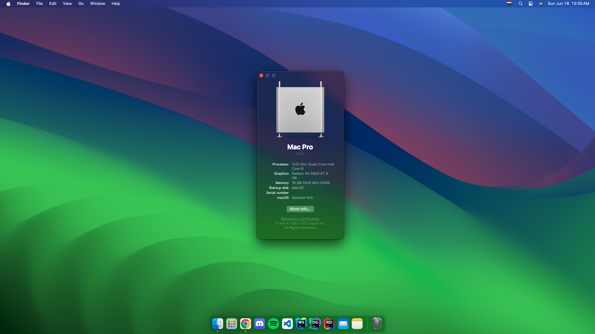

# Workstation-Hackintosh
My attempt at transforming my current PC build into a hackintosh.

## Install specifications

| Item     | Version       |
|----------|---------------|
| MacOS    | Ventura 13.4  |
| OpenCore | 0.9.3-RELEASE |
| BIOS     | F21           |

### Sonoma Upgrade

You can upgrade to sonoma using this setup, I did not find any issues in either OS versions. However at the time of creating this it is still in beta, so do it at your own risk. You can download the Install Assistant from [this link](https://swcdn.apple.com/content/downloads/23/44/032-94352-A_DB05J15QWT/4x91v0yzolyiat5cat76ieu0h78aeu3d03/InstallAssistant.pkg) which will help you upgrade.

## PC Specifications

| Component Type | Component                                |
|----------------|------------------------------------------|
| CPU            | Intel Core I3-13100                      |
| GPU            | Radeon RX 6650 XT                        |
| Motherboard    | Gigabyte B660 DS3H AX DDR4               |
| RAM            | Corsair Vengance LPX 2 x 8GB 3200Mhz Kit |
| Storge         | Crucial P3 Plus 1TB                      |
|                | Crucial P3 Plus 1TB                      |

## Component Support

| Component               | Support                   | Description                                                                                          |
|-------------------------|---------------------------|------------------------------------------------------------------------------------------------------|
| CPU                     | Full support              | Spoofed to an i5 10th gen. Power manegement has been patched using CPUFriend.                        |
| GPU                     | Full support              | Supported using AMDRadeonNavi2xExt kext.                                                             |
| RAM                     | Full support              | Any RAM should work with this configuration.                                                         |
| Storage                 | Full support              | Any SSD/HDD should work, though having an SSD is highly recommended.                                 |
| Audio (IN/OUT/Internal) | Full support              | Supported using AppleALC kext.                                                                       |
| USB A/C 2.0/3.0 Ports   | Full support              | Fully supported using custom SSDT and kext.                                                          |
| Ethernet (RJ45)         | Full support              | Support using RealtekRTL8111 kext.                                                                   |
| Wifi / Bluetooth        | No support for stock part | Motherboard WiFi/BT doesn't work. Please read the wireless card support section below for more info. |
| Shutdown/Restart/Sleep  | Full support              | Everything works as expected.                                                                        |

### Wireless card support

The original wireless card in my motherboard is the AMD Wi-Fi 6E RZ608 (MT7921K). This chipset was never supported in any version and there are no kexts for it available either. Check out [Dortania's Wireless Buyers Guide](https://dortania.github.io/Wireless-Buyers-Guide/) to find one compatible with your system.

#### My personal solution

After consulting with a couple of experienced people about this matter in the [r/hackintosh Paradise Discord](https://discord.gg/u8V7N5C) we came to the conclusion that there is only one chipset which has good native support and is kind of available online in my region (Hungary) for a relatively good price and specs. That is the BCM94360HMB chipset. Cards using this chipset have support for 2.4Ghz & 5Ghz with Bluetooth included. **This chipset also happens to have full support on the Dell Latitude E6430 models.**

## Security Notes

This OpenCore installation has only been configured with the most basic of security measures. It is up to you wether you want to add more security. You can read the [security part from Dortania's post install guide](https://dortania.github.io/OpenCore-Post-Install/universal/security.html).

## Updates

Updates I've made over time can be found here.

*Coming soon!*
